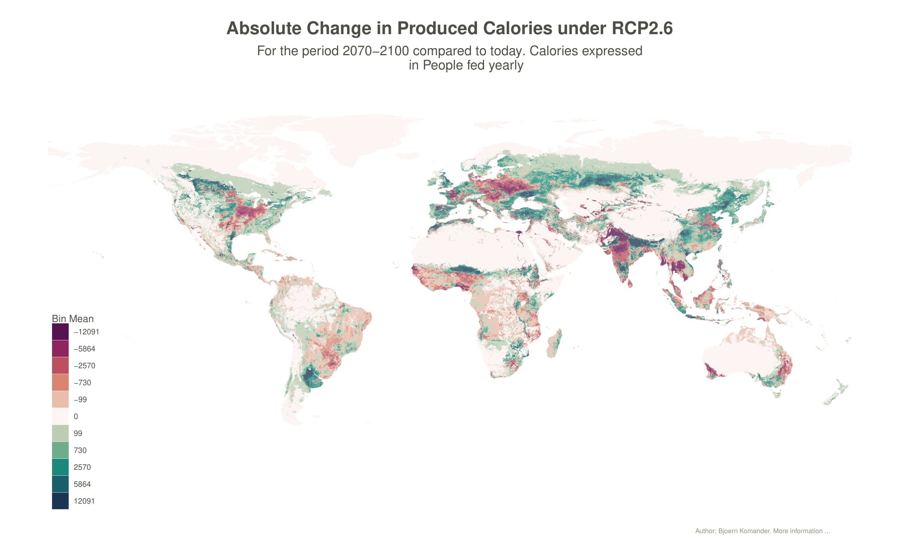

# Sustainability Index

This repo contains the code for creating the raw data later used for the sustainability index either described in the 
methodology file or presented [here]. 
The idea is to create an sustainability/fragility index based on the change of agricultural production under different 
Relative Concentration Pathways (RCP's).
Moreover, instead of aggregating the data on the country level, this index is gridded, in cells sized roughly 10x10km.
Moreover varieties of the index take both gridded gdp and population growth into account. 

### Visualization
Go to this [little dashboard](https://komanderb.shinyapps.io/fragility_dashboard/) for a small visualization. Note that this shows just some of the data in a very basic way and can be very slow. Also check out this [leaflet visualization](https://komanderb.shinyapps.io/dashboard_leaflet/). 
Both of the above links might not be available in the future.

### Sources
Agricultural Data: [Gaez v4](https://gaez.fao.org/)

Gridded GDP: [Global gridded GDP data set consistent with the shared socioeconomic pathways](https://zenodo.org/record/5880037#.Y5BneXbMKUk)

And the related [Paper](https://www.nature.com/articles/s41597-022-01300-x#Sec2)

Gridded Population [GPW v.4](https://sedac.ciesin.columbia.edu/data/collection/gpw-v4/sets/browse)

The final output of this repo is a data frame will all the data in interest. You can download the data [here] along with further visualizations and additional files. 